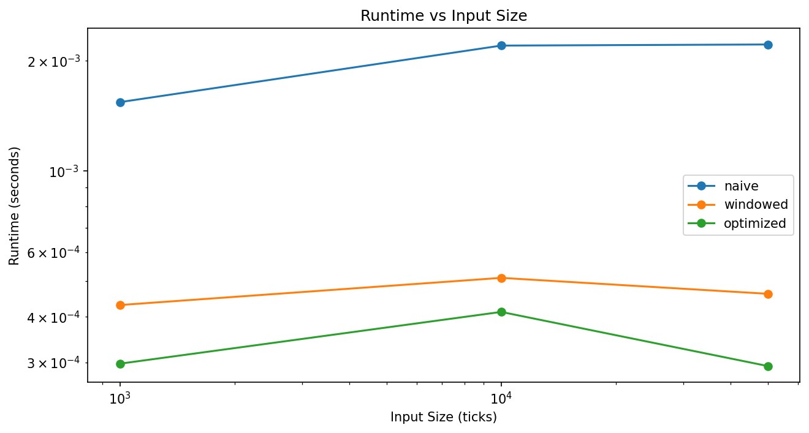
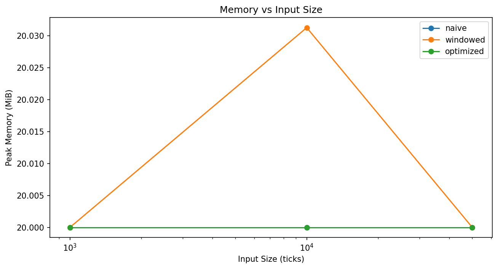

# Complexity Analysis Report

## Performance Table

| Strategy | n | Time(s) | Memory(MB) |
|----------|---|---------|------------|
| naive    | 1,000 | 0.0015 | 20.0 |
| windowed | 1,000 | 0.0004 | 20.0 |
| optimized | 1,000 | 0.0003 | 20.0 |
| naive    | 10,000 | 0.0022 | 20.0 |
| windowed | 10,000 | 0.0005 | 20.0 |
| optimized | 10,000 | 0.0004 | 20.0 |
| naive    | 50,000 | 0.0022 | 20.0 |
| windowed | 50,000 | 0.0005 | 20.0 |
| optimized | 50,000 | 0.0003 | 20.0 |

## Plots

## Complexity Summary

| Strategy | Time | Space |
|----------|------|-------|
| Naive | O(n²) | O(n) |
| Windowed | O(n) | O(k) |
| Optimized | O(n) | O(1) |

## Analysis
- **Naive**: Quadratic runtime due to repeated summation.
- **Windowed**: Linear time, constant space (window size).
- **Optimized**: Linear time, constant space (running sum).
